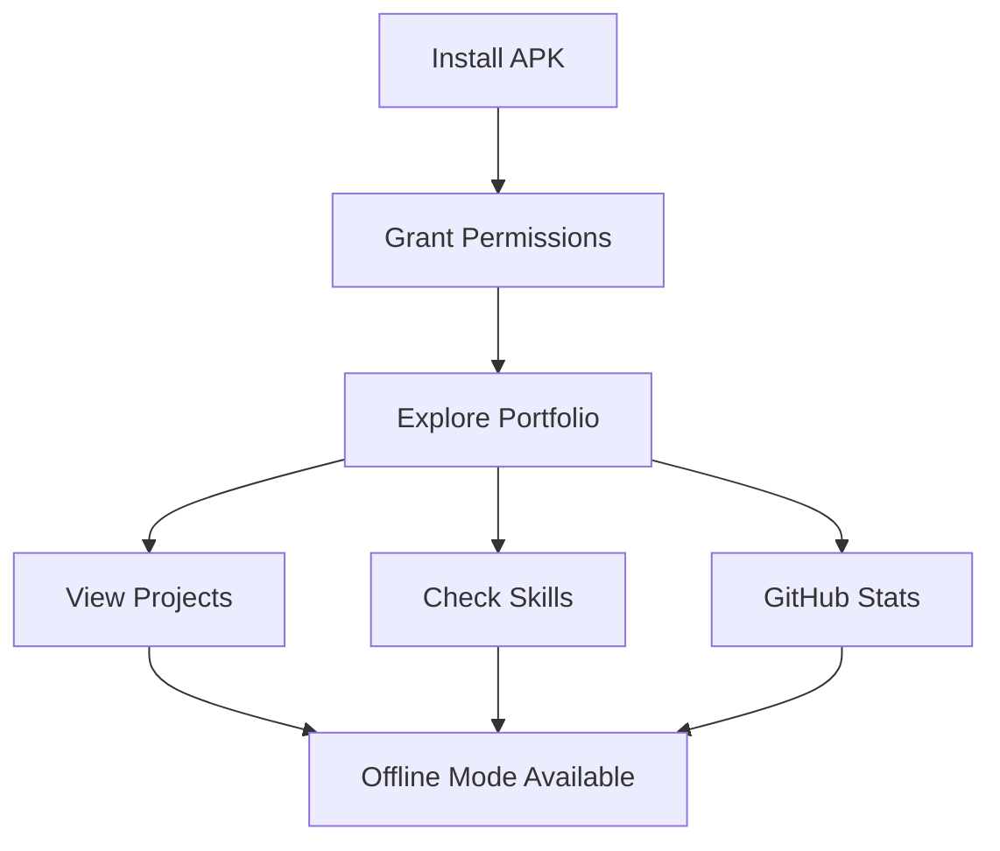

# Syed Arham Raza - Portfolio Mobile App

<div align="center">
  
  
  
  [](https://github.com/syedarhamraza/android-app/releases)
  
  <h3>A sleek Android portfolio app showcasing projects, skills, and experience</h3>
  <p>Built with Next.js + Capacitor for native mobile performance</p>
  
  [Download APK](#-download) •
  [Features](#-features) •
  [Tech Stack](#-tech-stack) •
  [Installation](#-installation) •
  
</div>

---


## Download


<div align="center">
  
  ### Latest Release: v1.0.4
  
  [](https://github.com/syedarhamraza/android-app/releases/download/v1.0.4/syedarhamraza.portfolio.v1.0.4.apk)
  
  > **Beta Notice**: This is a beta release for testing. GitHub stats and API-dependent features are currently under development.
  
</div>

## Automated Deployment

This repository features a **fully automated CI/CD pipeline**:

<div align="center">


</div>

### Deployment Workflow
1. **Source Code**: Main development in private repository
2. **Auto Sync**: GitHub Actions pushes built `out/` folder to this repo  
3. **Vercel Deploy**: Web version automatically deployed
4. **APK Build**: Capacitor wraps the app and builds Android APK
5. **Auto Release**: New APK automatically released on GitHub

> **Zero Manual Work**: Just push code changes, everything else is automated!


## Features 


<table>
<tr>
<td width="50%">

### **User Experience**
- Interactive project showcase
- Lightning-fast performance
- Smooth animations & transitions
- Native Android feel
- Modern responsive design

</td>
<td width="50%">

### **Technical Features**
- Smart local notifications
- Offline-first architecture
- Automated CI/CD pipeline
- Real-time deployment sync
- Static asset optimization

> **In Development**: GitHub stats integration and API-dependent features are currently being implemented.

</td>
</tr>
</table>

## 🛠️ Tech Stack

<div align="center">

### Frontend & Mobile


### Styling & Deployment


### Tools & Platforms


</div>

## Local Development

> **Important**: This repo contains only the production build (`out/` folder) and mobile wrapper. For local development of the web app, you'll need access to the private source repository.

### For APK Development Only

```bash
# 1️ Clone this repository
git clone https://github.com/syedarhamraza/android-app.git
cd android-app

# 2️ Install mobile dependencies
npm install

# 3️ Setup Capacitor (if not already configured)
npx cap sync

# 4️ Open in Android Studio
npx cap open android
```

### Prerequisites for APK Building
- **Node.js** 16+ 
- **Android Studio** with SDK
- **Java JDK** 11+
- **Capacitor CLI**: `npm install -g @capacitor/cli`

### Build Steps
1. **Open Android Studio**
2. **Select your target device/emulator**
3. **Click the Run button**
4. **Install the generated APK**

## Usage

<div align="center">



</div>

### Getting Started
1. **Install** the APK on your Android device
2. **Allow** notification permissions when prompted
3. **Explore** projects, skills, and achievements
4. **Enjoy** native mobile experience
5. **Works offline** with cached content

> **Current Status**: GitHub stats and dynamic API features are in development and may not display live data yet.

> **Note**: This is a deployment repository.

## Project Stats

<div align="center">
  
  
  
  

  
</div>

## Roadmap

### Current Development
- [ ]  **GitHub stats integration** - API connections in progress
- [ ]  **Dynamic portfolio data** - Real-time project updates

## 📄 License

This project is licensed under the **MIT License** - see the [LICENSE](LICENSE) file for details.

---

<div align="center">

### 🌐 Connect With Me

[](https://syedarhamraza-portfolio.vercel.app/)
[](https://github.com/syedarhamraza)
[](https://www.linkedin.com/in/syed-arham-raza/)
[](mailto:arhamraza399@gmail.com)

### ⭐ Don't forget to star this repo if you found it helpful!

</div>
