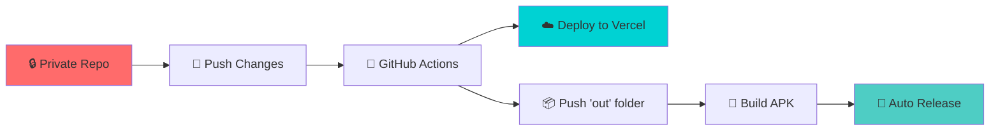
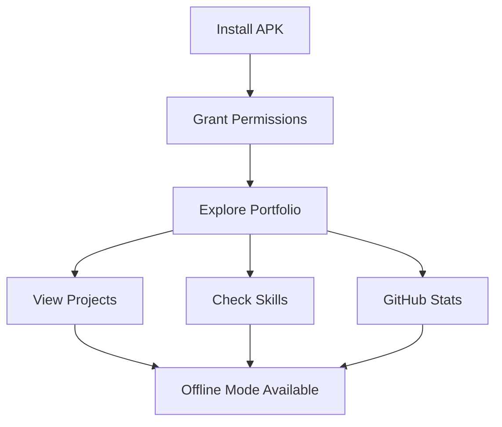

# Syed Arham Raza - Portfolio Mobile App

<div align="center">
  
  
  
  [](https://github.com/syedarhamraza/android-app/releases)
  [](LICENSE)
  [](https://github.com/syedarhamraza/android-app/stargazers)
  [](https://github.com/syedarhamraza/android-app/network/members)
  
  <h3>🚀 A sleek Android portfolio app showcasing projects, skills, and experience</h3>
  <p>Built with Next.js + Capacitor for native mobile performance</p>
  
  [📱 Download APK](#-download) •
  [🎯 Features](#-features) •
  [💻 Tech Stack](#-tech-stack) •
  [🚀 Installation](#-installation) •
  [📸 Screenshots](#-screenshots)
  
</div>

---

## 📱 Download

<div align="center">
  
  ### 🎉 Latest Release: v1.0.0-beta.1
  
  [](https://github.com/syedarhamraza/android-app/releases/download/v1.0.0-beta.1/syedarhamraza.portfolio.apk)
  
  > ⚠️ **Beta Notice**: This is a beta release for testing. GitHub stats and API-dependent features are currently under development.
  
</div>

## 🤖 Automated Deployment

This repository features a **fully automated CI/CD pipeline**:

<div align="center">



</div>

### 🔄 Deployment Workflow
1. **🔒 Source Code**: Main development in private repository
2. **⚡ Auto Sync**: GitHub Actions pushes built `out/` folder to this repo  
3. **☁️ Vercel Deploy**: Web version automatically deployed
4. **📱 APK Build**: Capacitor wraps the app and builds Android APK
5. **🎉 Auto Release**: New APK automatically released on GitHub

> **🎯 Zero Manual Work**: Just push code changes, everything else is automated!

## ✨ Features

<table>
<tr>
<td width="50%">

### 🎨 **User Experience**
- 📂 Interactive project showcase
- ⚡ Lightning-fast performance
- 🎭 Smooth animations & transitions
- 📱 Native Android feel
- 🌙 Modern responsive design

</td>
<td width="50%">

### ⚙️ **Technical Features**
- 🔔 Smart local notifications
- 🌐 Offline-first architecture
- 🤖 Automated CI/CD pipeline
- 🔄 Real-time deployment sync
- 📦 Static asset optimization

> **🚧 In Development**: GitHub stats integration and API-dependent features are currently being implemented.

</td>
</tr>
</table>

## 🛠️ Tech Stack

<div align="center">

### Frontend & Mobile


### Styling & Deployment


### Tools & Platforms


</div>

## 📸 Screenshots

<div align="center">
  
  <table>
    <tr>
      <td align="center" width="33%">
        
        <br/><strong>🏠 Home</strong>
      </td>
      <td align="center" width="33%">
        
        <br/><strong>📂 Projects</strong>
      </td>
      <td align="center" width="33%">
        
        <br/><strong>🎯 Skills</strong>
      </td>
    </tr>
  </table>
  
  ### 🎬 Demo in Action
  
  
</div>

## 🚀 Local Development

> **Important**: This repo contains only the production build (`out/` folder) and mobile wrapper. For local development of the web app, you'll need access to the private source repository.

### For APK Development Only

```bash
# 1️⃣ Clone this repository
git clone https://github.com/syedarhamraza/android-app.git
cd android-app

# 2️⃣ Install mobile dependencies
npm install

# 3️⃣ Setup Capacitor (if not already configured)
npx cap sync

# 4️⃣ Open in Android Studio
npx cap open android
```

### 🔧 Prerequisites for APK Building
- **Node.js** 16+ 
- **Android Studio** with SDK
- **Java JDK** 11+
- **Capacitor CLI**: `npm install -g @capacitor/cli`

### 📋 Build Steps
1. **Open Android Studio**
2. **Select your target device/emulator**
3. **Click the Run button** ▶️
4. **Install the generated APK**

## 🎯 Usage

<div align="center">



</div>

### Getting Started
1. **📲 Install** the APK on your Android device
2. **🔔 Allow** notification permissions when prompted
3. **🌟 Explore** projects, skills, and achievements
4. **📱 Enjoy** native mobile experience
5. **🔄 Works offline** with cached content

> **📍 Current Status**: GitHub stats and dynamic API features are in development and may not display live data yet.

## 🤝 Contributing

> **Note**: This is a deployment repository. For feature contributions, please reach out for access to the main development repository.

### 🔧 APK & Mobile Wrapper Contributions
You can contribute to the mobile wrapper and deployment process:

<details>
<summary><b>🛠️ Mobile Development Setup</b></summary>

```bash
# Fork this repository
git clone https://github.com/your-username/android-app.git
cd android-app

# Work with mobile-specific features
# - Capacitor configuration
# - Android native plugins
# - Mobile UI optimizations
# - GitHub Actions workflows

# Create feature branch
git checkout -b feature/mobile-improvement

# Make changes and test
npx cap sync
npx cap open android

# Commit and create PR
git commit -m "feat: improve mobile experience"
git push origin feature/mobile-improvement
```

</details>

### 💡 How You Can Help
- 🐛 Report mobile-specific bugs
- 📱 Suggest mobile UX improvements  
- 🔧 Optimize APK build process
- 🤖 Enhance GitHub Actions workflows
- 📝 Improve documentation

## 📊 Project Stats

<div align="center">
  
  
  
  
  
  
</div>

## 🛣️ Roadmap

### 🔄 Current Development
- [ ] 📊 **GitHub stats integration** - API connections in progress
- [ ] 📈 **Dynamic portfolio data** - Real-time project updates
- [ ] 🔌 **API optimization** - Performance improvements for data fetching

### 🚀 Upcoming Features  
- [ ] 🎨 **v1.1** - Advanced theming system
- [ ] 🌐 **v1.2** - PWA capabilities for web version
- [ ] 📱 **v1.3** - iOS version release
- [ ] 🌍 **v1.4** - Multi-language support
- [ ] ☁️ **v2.0** - Cloud sync & backup
- [ ] 📊 **v2.1** - Analytics dashboard

## 📄 License

This project is licensed under the **MIT License** - see the [LICENSE](LICENSE) file for details.

<div align="center">
  
  **Made with ❤️ by [Syed Arham Raza](https://arhamraza.me)**
  
</div>

---

<div align="center">

### 🌐 Connect With Me

[](https://arhamraza.me)
[](https://github.com/syedarhamraza)
[](https://linkedin.com/in/syedarhamraza)
[](mailto:syedarhamraza@example.com)

### ⭐ Don't forget to star this repo if you found it helpful!

</div>
